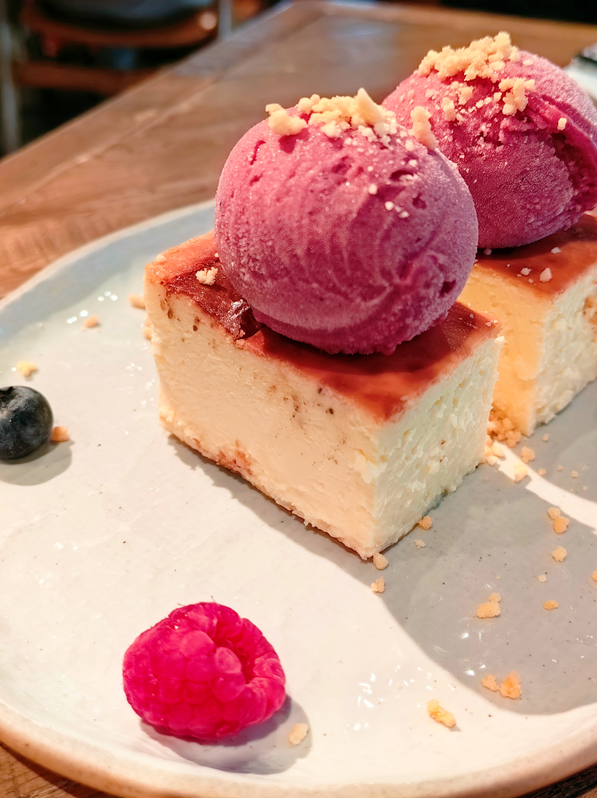

# LaPaloma（西营盘）

**探店 · 西环**

**LaPaloma：陆家嘴国金PINTXOS的（购买力平价汇率）平替/（官价汇率）贵替**

这家我最喜欢海鲜饭，米粒饱满，锅巴焦香。口感上比PINTXOS的厚重油脂感觉要清爽很多。美中不足是海鲜比PINTXOS偏少些，饭量也少些。

跟着小红书吃了这家的火腿，也不错，鲜香油润，盐度适中，不会齁咸。不过我反倒是觉得小红书上没推荐的牛肉配青酱很好吃，牛味饱满，汁水充盈，青酱微咸画龙点睛。

总的来说，转机/办事路过可以来尝尝，但是绝对不至于单独大老远跑过来尝。人均价格就是按照HKDCNY=2.0的购买力平价汇率换算PINTXOS的人均。

还是回上海吃PINTXOS吧，露天阳台还是很舒服的。

地址：西营盘皇后大道西189号西浦1楼

 
 
 
 
 
 
